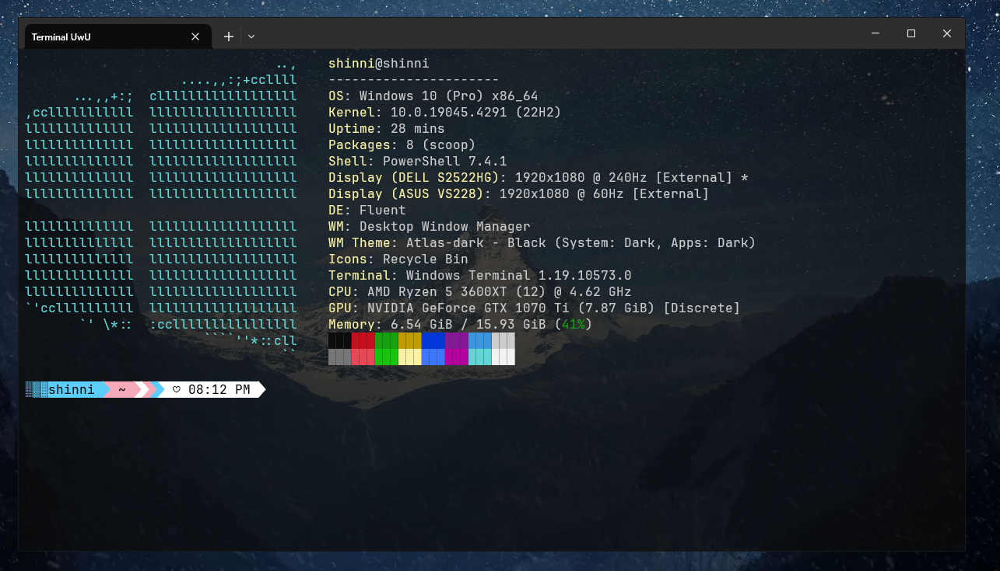

## Windows Terminal Customization



This repository contains configurations and instructions to customize your Windows Terminal appearance.

### Requirements

- PowerShell 7 (Required for optimal functionality)
- [Scoop](https://scoop.sh/) (A command-line installer for Windows)
- [Git](https://git-scm.com/) (To install the other packages)
- [StarShip](https://starship.rs/) (Minimal, blazing-fast, and infinitely customizable prompt for any shell!)
- [FastFetch](https://github.com/fastfetch-cli/fastfetch) (System Information)
- **Caskadiya Nerd Font** (For the terminal font face)

### Installation

1. **Download and Install Caskadiya Nerd Font:**
   - Download the font from [here](https://github.com/ryanoasis/nerd-fonts/releases/download/v3.2.1/CascadiaCode.zip).
   - Extract the ZIP file and install the fonts by either right-clicking on the `.ttf` files and selecting "Install. or by CTRL + A right-click on any file and "Install"

2. **Install PowerShell 7:**
   - Although the configuration can work with other versions, I recommend using PowerShell 7 as it doesn't display annoying text every time you open it.

3. **Run the following commands in your PowerShell terminal (Does not work with PowerShell 7, use PowerShell 5 instead):**
    ```powershell
    Set-ExecutionPolicy -ExecutionPolicy RemoteSigned -Scope CurrentUser; Invoke-RestMethod -Uri https://get.scoop.sh | Invoke-Expression; scoop install git; scoop install fastfetch; scoop install starship
    ```

    Or, you can run the individual commands:
    
    ```powershell
    Set-ExecutionPolicy -ExecutionPolicy RemoteSigned -Scope CurrentUser
    Invoke-RestMethod -Uri https://get.scoop.sh | Invoke-Expression
    scoop install git
    scoop install starship 
    scoop install fastfetch
    ```

    If installing `fastfetch` faces any issues, try running PowerShell as an administrator.

4. **Configure Windows Terminal:**
   - Open Windows Terminal.
   - Go to the settings (click on the down arrow in the terminal tab bar, then select "Settings").
   - Under "Startup," set the default terminal application to "Windows Terminal."
   - Under "Defaults," click on "Appearance."
   - Change the font face to "Caskadiya Nerd Font Mono."

5. **Clone/Download this repository to your local machine.**

6. **Navigate to the `.config` directory at `C:\Users\[name_of_pc]\.config\starship\starship.toml` and create a `starship` folder if it doesn't exist. Place the configuration file from [here](https://github.com/ShinniUwU/windows-terminal-dotfiles/tree/main/.config/starship) into this folder.**

7. **Customize your fastfetch configuration:**
   - Navigate to the `.config` directory and then into the `fastfetch` folder from [here](https://github.com/ShinniUwU/windows-terminal-dotfiles/tree/main/.config/fastfetch).
   - Feel free to tweak the settings according to your preferences. Refer to [fastfetch presets](https://github.com/fastfetch-cli/fastfetch/tree/dev/presets) for inspiration.

8. **Copy the PowerShell folder from this repository to your Documents folder.**

9. **The JSON file contains my other settings; do not copy them into your JSON settings since it won't work.**

### Fixing Script Execution Errors

If you encounter the error:

```
File C:\Users\[username]\OneDrive\Documents\PowerShell\Microsoft.PowerShell_profile.ps1 cannot be loaded. The file C:\Users\[username]\OneDrive\Documents\PowerShell\Microsoft.PowerShell_profile.ps1 is not digitally signed. You cannot run this script on the current system.
```

Follow these steps to resolve it:

1. **Change the Execution Policy:**
    ```powershell
    Set-ExecutionPolicy -ExecutionPolicy Unrestricted -Scope CurrentUser
    ```

2. **Unblock the File:**
    ```powershell
    Unblock-File -Path "C:\Users\[username]\OneDrive\Documents\PowerShell\Microsoft.PowerShell_profile.ps1"
    ```

3. **Run the Script Again:** After unblocking the file, you should be able to run the script without seeing the security warning each time.

### Getting Started

With the installations and configurations done, you are now ready to use your customized Windows Terminal. Open the terminal and enjoy your personalized setup!

### Inspiration

Check out the [video](https://youtu.be/AK2JE2YsKto?si=s6U8AnL6h7qeRE1c) that inspired this terminal customization.

For any further customization or troubleshooting, feel free to explore the repository and adjust the configurations to your liking.

